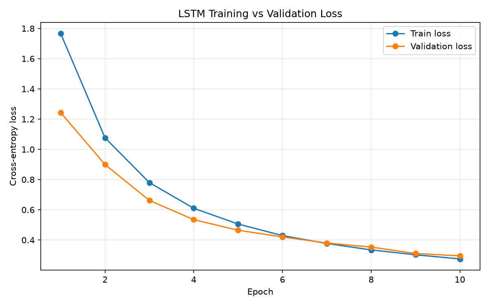

# Neural Melody Generator

A small project where I trained an LSTM on MIDI files so it can write new melodies one note at a time. I built it to learn how sequence models work, using music instead of text.

**Live demo:** https://neural-melody-generator.streamlit.app/
(It runs on free hosting, so it can take a minute to wake up if nobody has opened it for a while.)



## What I built

- Cleaned up MIDI files from the Lakh MIDI dataset and turned each song into a single melody
- Converted the notes into numbers and trained an LSTM to guess the next note from the previous 50
- Generated new melodies by picking one note at a time, with a temperature setting to control how adventurous it gets
- Put it in a Streamlit app where you can generate a melody and download it as a `.mid` file

There is a sample in `generated_melody_v1.mid`.

Tools: Python, PyTorch, pretty_midi, NumPy, Matplotlib, Streamlit.

## How it works

**The data.** I used the Clean MIDI subset of the Lakh dataset (17,167 files), but only 50 songs for this first version. 49 loaded fine and one was corrupted, so the code skips it.

The files were messier than I expected. Instrument names are often wrong (a drum track was labelled "piano"), so I ignore the names and take the non-drum track with the most notes. Chords were another problem, because the notes in a chord never start at exactly the same moment. I first grouped notes that started within 50 ms of each other, but chords still weren't collapsing, so I raised it to 150 ms and kept only the highest note.

That left 65 different pitches, which I turned into numbers. A window of 50 notes predicts the 51st, which gave 26,377 training examples.

**The model.** An embedding layer, two LSTM layers (128 hidden units), and a linear layer that scores the 65 possible next notes. I trained it with Adam (learning rate 0.001), batch size 64, for 10 epochs on CPU.

**Generating.** Start with 50 notes, predict the next one, add it, and repeat. A lower temperature gives safe, repetitive melodies. At 1.2 it sometimes jumped to odd low notes that it didn't play at 1.0.

## Results

| Epoch | Train loss | Validation loss |
|------:|-----------:|----------------:|
| 1 | 1.7666 | 1.2436 |
| 5 | 0.5057 | 0.4645 |
| 10 | 0.2747 | 0.2950 |

For comparison, pure guessing over 65 pitches would score about 4.17.

### My first run was overfitting

The first time I trained it I had no validation set, and the loss was only about 0.08, which looked too good. When I generated from a training seed, the model just played back the original song. The reason is that moving the window one note at a time makes neighbouring examples almost identical (they share 49 of 50 notes), so the model was basically memorising. I added a validation split and retrained from scratch, which gave the curve above.

## What's not great yet

- The validation split is random across windows, so windows from the same song can end up in both train and validation. That means the validation loss is probably a bit too optimistic. I want to split by song instead.
- 49 songs is small. It picks up local patterns but not the bigger structure of a song.
- It only predicts pitch, not how long a note lasts. Every note is the same length, so there is no rhythm.
- Chords and other instruments get thrown away in preprocessing.
- The demo starts from random pitches instead of a real musical phrase.
- Browsers can't play `.mid` files, so the demo gives you a download.

## What's next

- Split train and validation by song
- Use a few hundred songs instead of 49
- Build a Transformer and compare it with the LSTM on the same data
- Predict note length as well as pitch
- Play the audio directly in the browser

## Running it

```bash
git clone https://github.com/swapnali21chavan/Neural_Melody_Generator.git
cd Neural_Melody_Generator
pip install -r requirements.txt
streamlit run app.py
```

The app loads `melody_lstm.pth` and `vocab.pkl` from the main folder.

To retrain, download the Clean MIDI subset from the [Lakh MIDI page](https://colinraffel.com/projects/lmd/), extract it into `data/clean_midi/`, and run the main notebook.

## Files

```
01_setup_check.ipynb         project log, step by step
02_data_exploration.ipynb    data pipeline, training and generation
app.py                       Streamlit demo
requirements.txt
melody_lstm.pth              trained weights
vocab.pkl                    pitch <-> number mappings
loss_curve_lstm.png
generated_melody_v1.mid
```

Dataset: Lakh MIDI Dataset by Colin Raffel, https://colinraffel.com/projects/lmd/
